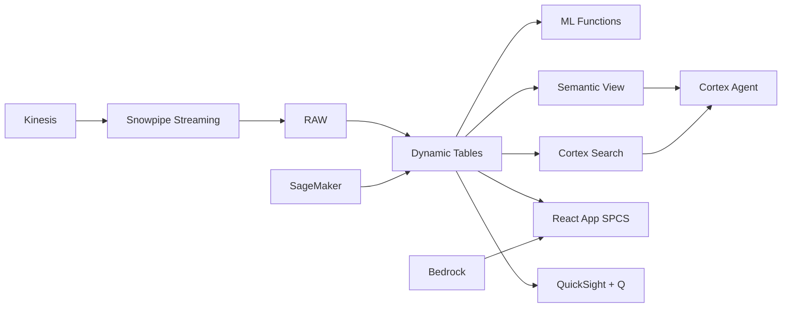

# Fraud Detection & AML Compliance

Philippine remittance companies process $36B annually under strict BSP/AMLC oversight — Snowflake combines Textract-parsed KYC documents with transaction anomaly detection and ML classification for end-to-end fraud and AML compliance.

## Architecture

The Philippines' $36B remittance industry operates under strict BSP and AMLC oversight. A Philippine remittance company must monitor 5.6M monthly transactions across 200+ corridors for money laundering, terrorism financing, and fraud. Manual KYC review takes days. Alert investigation backlogs grow. STR filing deadlines loom. Snowflake automates the entire pipeline — from document parsing to anomaly detection to STR generation.



## Snowflake Capabilities

| Capability | Implementation |
|-----------|---------------|
| Dynamic Tables | ACCOUNT_RISK_SCORE / STRUCTURING_DETECTION / NETWORK_ANALYSIS / AML_TIMESERIES |
| ML Functions | ML.ANOMALY_DETECTION + ML.CLASSIFICATION |
| Cortex AI | AI_PARSE_DOCUMENT, AI_CLASSIFY, COMPLETE |
| Cortex Search | 95 documents indexed |
| Cortex Agent | AML_COMPLIANCE_AGENT |
| Semantic View | AML_COMPLIANCE_ANALYTICS |
| React App (SPCS) | 5 tabs + DemoGuide |


## AWS Services

| Service | Role in Demo |
|---------|-------------|
| Amazon Kinesis | Stream remittance transactions in real-time for monitoring |
| Amazon Textract | Extract data from scanned KYC documents and IDs |
| Amazon SageMaker | Train fraud/AML detection models |
| Amazon Bedrock (Claude) | Generate STR narratives and compliance summaries |
| Amazon QuickSight + Q | AML operations dashboard for compliance team |
| AWS Step Functions | Orchestrate KYC → scoring → alert → STR workflow |


## Personas

| Persona | Role | Key Questions |
|---------|------|---------------|
| **Atty. Margarita Elena Locsin** | Chief Compliance Officer | "How many STRs are pending filing this week?" "Which accounts triggered AML alerts today?" |
| **Gabriel Santos Ocampo** | Fraud Investigations Lead | "Show me the structuring pattern for account X." "Which accounts are linked in this fraud ring?" |


## Data

| Table | Rows | Description |
|-------|------|-------------|
| KYC_DOCUMENTS | 320,000 | Scanned IDs and documents processed via Textract |
| TRANSACTIONS | 5,600,000 | 60 days of remittance transactions from Kinesis |
| ACCOUNTS | 780,000 | Customer accounts with risk tier and KYC status |
| ALERTS_HISTORY | 45,000 | Historical AML alerts with dispositions |
| SANCTIONS_LIST | 28,000 | Consolidated sanctions watchlists (OFAC, UN, EU, BSP) |
| STR_FILINGS | 1,200 | Suspicious Transaction Reports filed with AMLC |
| BSP_CIRCULARS | 95 | BSP regulatory circulars on AML/CFT requirements |


## Build Instructions

### Prerequisites
- Snowflake account with ACCOUNTADMIN access
- Cortex AI enabled (ML Functions, Search, Agent)
- Warehouse: AML_WH (Medium)
- AWS CLI with access (us-west-2)

### Deployment

```bash
snowsql -f snowflake/00_setup.sql
snowsql -f snowflake/01_marketplace_install.sql
snowsql -f snowflake/02_raw_tables.sql
snowsql -f snowflake/03_staging.sql
snowsql -f snowflake/04_dynamic_tables.sql
snowsql -f snowflake/05_search.sql
snowsql -f snowflake/06_ml_models.sql
snowsql -f snowflake/07_semantic_view.sql
snowsql -f snowflake/08_agent.sql
```

### React App (SPCS)
```bash
cd app && npm ci && npm run build
docker build -t aws-philippines-remittance-fraud-aml-app .
docker push bdiqc8sm-default.registry.snowflakecomputing.com/fraud_aml/app/aws_philippines_remittance_fraud_aml/app:latest
```

### Demo Mode
Open the app URL with `?demo=true` for presenter view.

## Build Modes

### Snowflake Only
Run scripts 00-08 (skip AWS-specific integration). Uses:
- **Snowpipe Streaming SDK** instead of Amazon Kinesis
- **AI_PARSE_DOCUMENT (native)** instead of Amazon Textract
- **ML.ANOMALY_DETECTION + ML.CLASSIFICATION (native)** instead of Amazon SageMaker
- **Cortex Complete** instead of Amazon Bedrock (Claude)
- **Snowflake Intelligence (Cortex Analyst)** instead of Amazon QuickSight + Q
- **Task Graphs (DAG orchestration)** instead of AWS Step Functions

### Full AWS + Snowflake
Run all scripts including AWS integration. Deploy QuickSight dashboard from `quicksight/`.

## Business Impact

Industry research and Snowflake customer outcomes:
- **AMLC received 2.3M covered and suspicious transaction reports in 2023** — [AMLC Philippines](https://www.amlc.gov.ph/)
- **Philippine financial institutions spend ₱15-25B annually on AML compliance** — [BAP Philippines](https://www.bap.org.ph/)
- **AI-powered AML reduces false positives by 60-80%, saving investigation hours** — [Deloitte](https://www.deloitte.com/global/en/Industries/financial-services/perspectives.html)
- **Automated STR generation reduces filing time by 80% while improving quality** — [McKinsey](https://www.mckinsey.com/industries/financial-services/our-insights)
- **Western Union** (Snowflake customer): processes 1B+ cross-border transactions on Snowflake with real-time compliance and fraud detection across 200+ countries -- [snowflake.com/customers/western-union](https://www.snowflake.com/en/customers/all-customers/case-study/western-union/)

## Key Demo Numbers

- **5.6M** transactions monitored monthly
- **847 alerts** active in AML investigation queue
- **23 STRs** pending AMLC filing
- **47 accounts** linked in detected mule ring
- **₱23M** in structured transactions identified
- **320K documents** parsed by AI_PARSE_DOCUMENT


## License

Apache 2.0 — See [LICENSE](LICENSE) for details.

This is a personal demo project and is not an official Snowflake offering. It comes with no support or warranty.